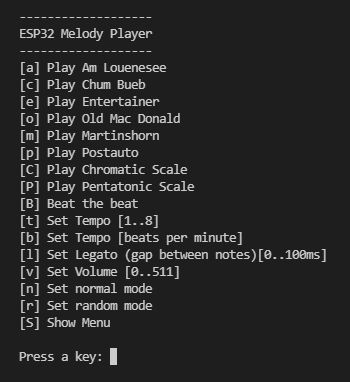

# MelodyPlayer
It is often complained that the tone() functionality of the Arduino is 
missing in ESP32. Therefore I wanted to investigate how to realize tones
 with the pwm functions implemented in esp32-hal-ledc module.

 For my experiments I used an ESP32 DevKit V1 and a 8 Ohm / 0.5 Watt
  speaker connected to the ESP32 via a MOS-FET driver. Alternatively a 
  piezzo buzzer can be connected directly to the ESP32 output pin and 
  GND.  

  ### Wiring
  ```
   .--------------.
   |      Vin(5V) o---->   5V o--------------+------o
   |              |                          |      |
   |              |                         _|_     |   _/|
   |    ESP32     |                         / \     '--|  |
   |              |                         ¨|¨     .--|_ | Speaker
   |              |                          |      |    \|
   |              |                          +------o
   |              |                          |
   |              |                      |¦--' N-CH MOSFET
   |              |                      |¦<-. T40N03G
   |       GPIO25 o---->  Vin o-----+----|¦--|
   |              |                 |        |
   |              |                |¨|       |
   |              |                |_| 10k   |
   |              |                 |        |
   |          GND o---->  GND o-----+--------'
   '--------------'
  ```

## Implementation
My simple melody player should be able to play notes from the ESP32's 
memory. The ledc module already defines the note names in commonly known 
semitone steps as 
```
NOTE_C, NOTE_Cs, NOTE_D, NOTE_Eb, NOTE_F, NOTE_Fs, 
NOTE_G, NOTE_Gs, NOTE_A, NOTE_Bb, NOTE_B, NOTE_MAX
```
and also provides the function ledcWriteNote(channel, note, octave). As
we can see, no note length can be specified with ledcWriteNote(). 
Therefore, we have to define our own convention for this.

For the note lengths I used the enumeration class
```
enum class N_LEN { N64=1, N32=2, N32d=3, N16=4, N16d=6, N8=8, N8d=12, 
N4=16, N4d=24, N2=32, N2d=48, N1=64, N1d=96 }
```
N_LEN::N4 stands for a quarter note and N_LEN::N2d for a dotted half 
note. The numerical values stand for the number of sixty-fourths. But 
because these are only relative note lengths, the tempo still has to be 
specified.

Again, I use an enumeration class for the tempo:
```
enum class TEMPO { LARGO=50, LARGHETTO=63, ADAGIO=71, ANDANTE=92, MODERATO=114, 
ALLEGRO=144, PRESTO=184, PRESTISSIMO=204 }
```
The numbers represent quarter beats per minute.

To simplify the notation of a melody we define a type musicNote as 
follows:
```
typedef struct { note_t note; uint8_t octave; N_LEN len; } musicNote;
```
Now we have everything together and can write down a melody: 
```
  musicNote entertainer[] =
  {
    { NOTE_D,  4, N_LEN::N8 },
    { NOTE_Eb, 4, N_LEN::N8 },
    { NOTE_E,  4, N_LEN::N8 },
    { NOTE_C,  5, N_LEN::N4 },
    { NOTE_E,  4, N_LEN::N8 },
    { NOTE_C,  5, N_LEN::N4 },
    { NOTE_E,  4, N_LEN::N8 },
    { NOTE_C,  5, N_LEN::N8 },
    { NOTE_C,  5, N_LEN::N2 },
    { REST,    5, N_LEN::N8 },
    { NOTE_C,  5, N_LEN::N8 },
    { NOTE_D,  5, N_LEN::N8 },
    { NOTE_Eb, 5, N_LEN::N8 },
    { NOTE_E,  5, N_LEN::N8 },
    { NOTE_C,  5, N_LEN::N8 },
    { NOTE_D,  5, N_LEN::N8 },
    { NOTE_E,  5, N_LEN::N4 },
    { NOTE_B,  4, N_LEN::N8 },
    { NOTE_D,  5, N_LEN::N4 },
    { NOTE_C,  5, N_LEN::N2d},
    { REST  ,  5, N_LEN::N1d},
  };
  constexpr int len_entertainer = sizeof(entertainer) / sizeof(entertainer[0]);
```
 The attentive reader has noticed that there are also rests in the melody. 
 However, a rest is not defined in the ledc module, whereas the enumeration of 
 notes contains the value NOTE_MAX. If we call the function ledcWriteNote() 
 with this value, nothing happens and a 0 is returned. We can take advantage of 
 this and define a synonym for a rest: `#define REST NOTE_MAX`. The octave does 
 not matter when notating a rest like `{ REST, 5, N_LEN::N8 }`.

It should be possible to play a melody in parallel to other tasks. That's why I 
couldn't use delay() for determining the note length. I decided to do the 
timing with the function millis() and not with a timer interrupt. 

So the basic function should play a note with a certain duration once, although 
it is called continuously in the main loop of the program.

When we play a note, we have to remember the start time and that it was 
started. Then we have to determine when the note duration has expired. At this 
time we can remember that the note was played. The function playNote can then 
be coded like this: 
```
  void playNote(musicNote n)
  {
    if (_notePlayed) return; // play the note only once
    if (! _started)
    {
        // Caveat: ledcWriteNote() sets the resolution to 10 bit. 
        //         That's why the volume ranges from 0..511 (0 .. 50 % duty cycle).
		
        // ledcWriteNote() returns 0 when note is a REST, so we switch off the channel
        // by setting the dyty cycle to 0, otherwise we set it to the value of volume 
        ledcWriteNote(_channel, n.note, n.octave) ? ledcWrite(_channel, _volume) : ledcWrite(_channel, 0);
        _msStart = millis();  // remember the start time
        _started = true;      // set the started flag
        return;    
    }

    // is the note length reached?
    if ((millis() - _msStart) > 60000 * (uint32_t)n.value / N4_LEN / (uint32_t)_tempo) 
    {
        ledcWrite(_channel, 0); // stop the tone
        _started    = false;    // reset the started flag
        _notePlayed = true;     // set the played flag
    }
```
Once the note is played, it will never be played again, although playNote() 
will continue to execute in the main loop. We therefore need another function 
to rearm the playback by setting _notePlayed = false. 
```
  void rearmNoteAfter(uint32_t msWait)
  {
    if((millis() - _msPrevious >= msWait) ? (_msPrevious = millis(), true) : false) _notePlayed = false;
```
To play a melody, we only need to call playNote() once for all notes of the melody. So the 
corresponding function can look like this: 
```
  void playMelody(musicNote m[], int len)
  {
    _notePlayed = false;
    if (_noteCounter >= len) 
    {  
        return; // whole melody is played
    }
    playNote(m[_noteCounter]);
    if (_notePlayed) _noteCounter++; // take next note in  melody
}	
```
## User Interface 
In order to be able to conveniently try out the methods implemented in the MelodyPlayer class, 
I again designed a menu structure as a Comman Line Interface (CLI).


## Program Code
The MelodyPlayer offers further methods. For example, with `setVolume()` the duty cycle of the 
signal and thus the volume of the sound can be set. With `setRandom()` the MelodyPlayer is switched 
to random mode, which randomly selects the notes of a melody. The gap between two notes can be set 
with `setLegato()` from 0..100 ms and the tempo is set with `setTempo()` in predefined steps or as a 
numerical value in beats per minute. And finally the method `playBeats()` mimics a metronome beating 
the beat at the set tempo.
